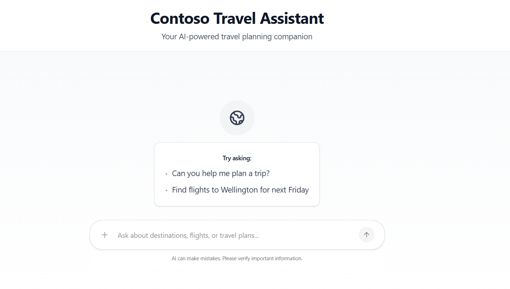
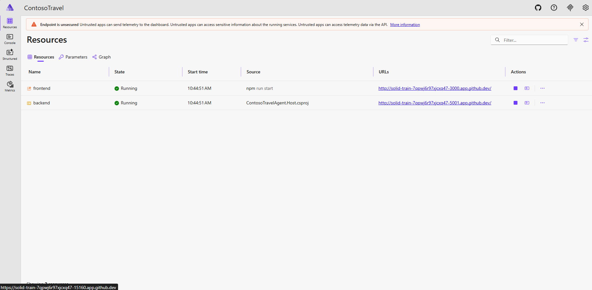

# Setting Up Your Environment

## Prerequisites

- Azure Subscription - Sign up for a free [Azure account](https://azure.microsoft.com/free/) if you don't have one already.

### Development Tools

Note: The recommended way to run the application is using GitHub Codespaces, which provides a ready-to-use environment with all dependencies pre-installed. If you prefer to set up your local environment, ensure you have the following tools installed:

- [.NET 10 SDK](https://dotnet.microsoft.com/download) - Required for backend services
- [Node.js 18+](https://nodejs.org/en/download/) - Required for frontend development
- [Azure Developer CLI (azd)](https://learn.microsoft.com/azure/developer/azure-developer-cli/install-azd) - For provisioning and managing Azure resources
- [Docker Desktop](https://www.docker.com/products/docker-desktop/) - For containerization and local development
- [Aspire CLI](https://aspire.dev/get-started/install-cli/) - For local orchestration and monitoring of agent services

---

## Set Up Source Code Repository
### 1. Cloning the repository:

If you don't have **GitHub Account** yet, sign up for a free account [here](https://github.com/join).

The source code is in [aigenius-maf-travel-assistant](https://github.com/binarytrails-ai/aigenius-maf-travel-assistant) GitHub repository.


Fork this repository to your own GitHub account. </br>
[](https://github.com/binarytrails-ai/aigenius-maf-travel-assistant/fork)

### 2. Create a Codespace

The recommended way to work through this session is with **GitHub Codespaces**, which provides a ready-to-use environment with all required tools.

Once you've forked the repository, navigate to your forked repository on GitHub and click the green **Code** button, then select the **Codespaces** tab and click **Create codespace on main**.

The Codespace will be pre-configured with all the necessary dependencies and tools to run the labs.

!!! Warning "It may take a few minutes for the Codespace to be created and all dependencies to be installed."
    If you encounter any issues, refer to the [GitHub Codespaces documentation](https://docs.github.com/en/codespaces) for troubleshooting tips and solutions.

---

## Set Up Azure Environment

### 1. Authenticate with Azure

First, authenticate with your Azure account using the Azure Developer CLI:

```bash
azd auth login --use-device-code
```

Follow the prompts to complete the authentication process in your browser.

### 2. Create and Configure Environment

Create a new environment for your Azure resources:

```bash
azd env new dev
azd env select dev
azd env set AZURE_LOCATION australiaeast
```

### 3. Provision Azure Resources

1. Create all required Azure infrastructure using the following command. This command will deploy resources defined in the `infra` folder.

    ```bash
    azd provision
    ```

1. Navigate to the [Azure Portal](https://portal.azure.com) and verify the resources under the resource group `rg-aiagent-ws-dev`.
2. A new `.env` file has been created in the root of the repository with all necessary environment variables for connecting to Azure resources. These will be used when running the application locally.

### 4. Load Sample Data

The application uses sample data which needs to be loaded into the Cosmos DB instance that was provisioned in the previous step.

Run the following command from a new terminal window to execute the script. You can also use the Play button in Visual Studio Code to run the script directly from the editor.

```bash
dotnet run scripts/seed-cosmosdb/Program.cs
```

### 5. Deploy Application to Azure

1. The application uses containerized services for the frontend and backend, which are deployed to Azure Container Apps. Run the following command to build and deploy these services to Azure:

    ```bash
    azd deploy
    ```

2. Once deployment completes, retrieve the frontend URL from your environment variables using the following command:

    ```bash
    # Linux/macOS
    azd env get-values | grep FRONTEND_URI
    ```

    ```powershell
    # Windows PowerShell
    azd env get-values | Select-String "FRONTEND_URI"
    ```

    Copy the value and open it in your browser to access the application.

    

---

## Running the Application Locally

For local development and testing, you can run the application on your machine or Codespace. 

This uses the same Azure resources (AI Foundry, Cosmos DB) that were provisioned during deployment, allowing you to develop and test changes before deploying them. The environment variables for connecting to Azure resources are setup in the .env file when you provision the infrastructure.

### 1. Build the Frontend Application

Open a new terminal in Visual Studio Code and navigate to `src/frontend` folder and build the application:

```bash
cd src/frontend
npm install
npm run build
```

### 2. Start the Application

The application uses .NET Aspire to orchestrate all services (backend and frontend) with a single command and provides a dashboard for monitoring.

Open a new terminal in Visual Studio Code and navigate to `src/ContosoTravel.AppHost` folder and run the application:

```bash
cd src/ContosoTravel.AppHost
dotnet run
```

### 3. Access the Application

1. To access the .NET Aspire dashboard:
    
    - **Local Development**: Open your browser to `http://localhost:15160`
    - **GitHub Codespaces**: When the application starts, Codespaces will automatically forward port 15160.
        Go to the **Ports** panel in VS Code, find port **15160**, and click the **globe icon** (🌐) to open the dashboard in your browser.
        

    

2. You can see the links to access the frontend and backend services there. Click on the frontend link to open the Contoso Travel Agent application in your browser.

---
