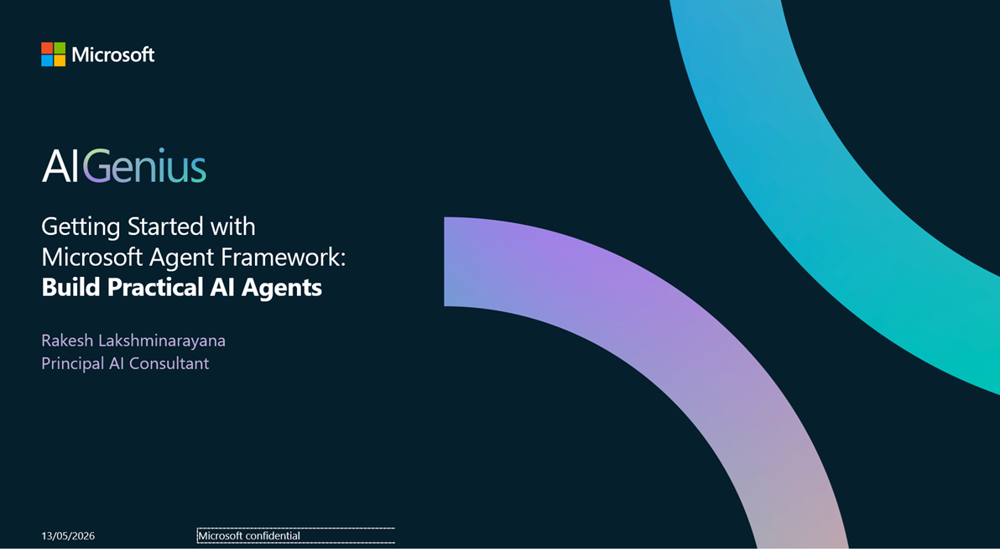
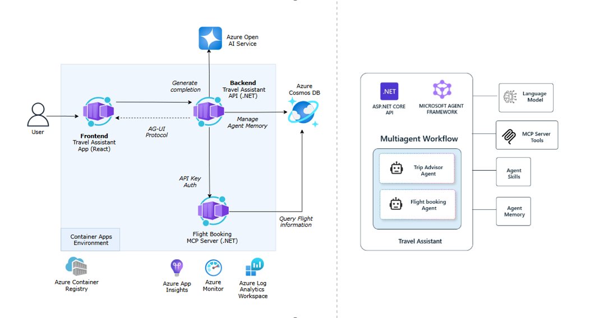

# Getting Started with Microsoft Agent Framework: Build Practical AI Agents



## Session Information

AI agents are moving fast — but building one that delivers real value requires more than just prompts.

In this session, you'll get a hands-on introduction to the Microsoft Agent Framework, focusing on how to design and build practical AI agents that can reason, take actions, and integrate with real systems. You'll explore how agentic AI fits into modern application architectures and how developers can move from experimentation to production-ready agents.

### You Will Learn

- Core concepts behind agentic AI and intelligent agents
- How the Microsoft Agent Framework is structured and applied
- How to build agents that interact with tools, APIs, and workflows
- Best practices for creating practical, extensible AI agents

---

## Application Overview

This repository provides a reference implementation of an AI-powered travel assistant built with the Microsoft Agent Framework. It demonstrates the following key capabilities:

!!! tip "New to the Microsoft Agent Framework?"
    Start with the foundation labs in [labs/00-foundations](https://github.com/binarytrails-ai/aigenius-maf-travel-assistant/tree/main/labs/00-foundations). 
    
    These standalone examples introduce core concepts of Microsoft Agent Framework in a simplified context.

- **Agent Hosting** - Deploy agents using the AG-UI protocol for seamless integration with AI interfaces
- **Personalization** - Store and retrieve user preferences for personalized experiences
- **AI Skills** - File-based skills for extending agent capabilities with custom logic and resources on demand
- **MCP Integration** - Connect to Model Context Protocol (MCP) servers with secure authentication
- **Human-in-the-Loop** - Approve or Reject agent actions in real-time for safe and controlled execution
- **Multi-Agent Orchestration** - Coordinate specialized agents to handle complex, multi-step travel planning tasks

---

## Architecture



### Key Components

- **Frontend (Container App)** - User interface built with CopilotKit to interact with the travel assistant agent.
- **Backend API (Container App)** - .NET 10 Asp.NET Core API that hosts the Travel Assistant agent. The API publishes the agent via the AG-UI protocol for frontend integration and manages agent execution, state, and tool interactions.
- **MCP Server (Container App)** - MCP server implementation to manage flight data and booking.
- **Cosmos DB** - Azure Cosmos DB instance for storing user preferences, and other application data.
- **Azure AI Foundry** - Provides access to Azure OpenAI models.
- **Observability** - OpenTelemetry for distributed tracing and Azure Monitor for centralized logging and monitoring of agent interactions.

---

## Let's Get Started

Head over to the [Environment Setup](./00-setup_instructions.md) page for instructions on setting up your development environment and running the travel assistant application. Once you have the application up and running, you can explore the following scenarios:

### Personalization with User Preferences

This scenario demonstrates how the agent stores and retrieves user preferences to provide personalized travel recommendations.

**Step 1: Initial Conversation - Building Profile**

Start the conversation with:

```
Can you help me plan a trip?
```

*Expected Response:* Agent greets you and asks about your travel preferences (e.g., budget, travel style, interests).

**Step 2: Answer the Agent's Questions**

Respond to the agent's questions to build your profile. For example:

```
I want to plan a trip with a budget of around $2,000. I love hiking and outdoor activities.
```

*Expected Response:* Agent provides personalized destination recommendations and stores your profile information (travel style, budget, interests, past trips, places to visit).

**Step 3: Test Profile Memory**

Start a new conversation by clicking on **New Chat** in the frontend UI, then ask:

```
I want to plan my next vacation
```

*Expected Response:* Agent references your stored profile and provides personalized recommendations based on your preferences.

---

### Flight Booking with Approval Workflow

This scenario demonstrates the Human-in-the-Loop capability where the agent requests approval before executing actions.

**Step 1: Search for Flights**

Start a conversation with:

```
Find flights from Melbourne to Wellington leaving next Friday
```

The agent will search available flights and present options with details such as departure time, airline, and price.

**Step 2: Request a Booking**

After reviewing the flight options, ask the agent to book a specific flight. For example:

```
Book the flight QF107
```

The agent will display a booking confirmation request and wait for your approval.

**Step 3: Approve the Action**

Click the **Approve** button when the approval dialog appears in the UI.

The agent will complete the booking and provide confirmation with flight details and a booking reference number.

---

## Additional Resources

Refer to the [Learning Resources](./resources.md) page for more resources on Microsoft Agent Framework, code samples, and related technologies.
