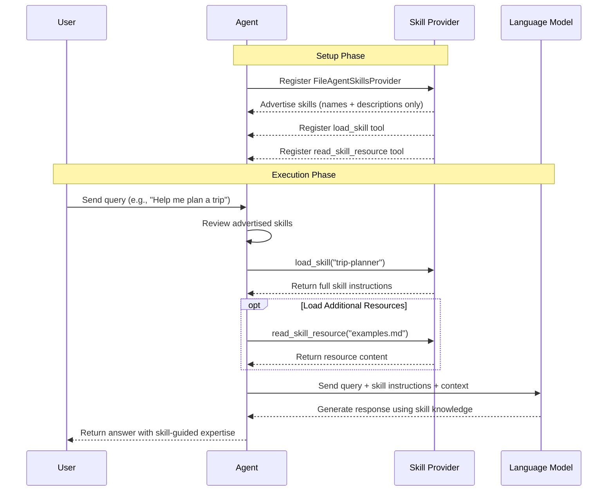

# Lab 03: File-Based Agent Skills

In this lab, you will learn how to use **file-based skills** with the `FileAgentSkillsProvider` for progressive disclosure of agent capabilities.

You will use modular skill packages (`SKILL.md` files) that provide domain-specific instructions to the agent on demand.

By the end of this lab, you will:

- Understand how `FileAgentSkillsProvider` works
- See progressive disclosure in action (advertise -> load -> read resources)
- Organise agent capabilities into reusable, composable skill packages

## Key Implementation Details

### What are File-Based Skills?

Skills are self-contained units of domain knowledge stored as `SKILL.md` files in a directory. Each skill has a name, a short description, and detailed instructions.

Rather than loading all skill instructions upfront (which wastes context tokens), `FileAgentSkillsProvider` uses **progressive disclosure**:

1. **Advertise** — the agent receives only the skill name and description (~100 tokens per skill)
2. **Load** — the agent calls `load_skill` to fetch full instructions for skills it actually needs
3. **Read resources** — the agent calls `read_skill_resource` to pull in supplementary files on demand

This means large sets of skills can be registered without bloating the context window.

### Skill Directory Structure

Skills are under the `./skills` folder, one sub-directory per skill:

```
skills/
  weather-info/
    SKILL.md          ← name, description, and instructions
  visa-assistance/
    SKILL.md
  trip-planner/
    SKILL.md
```

Each `SKILL.md` starts with a YAML front-matter block that provides the advertised name and description:

```markdown
---
name: weather-info
description: Provides weather forecasts for travel destinations
---

# Weather Information Skill
...full instructions loaded on demand...
```

### Registering the Skills Provider

Create a `FileAgentSkillsProvider` pointing at the skills directory, then pass it as an `AIContextProvider`:

```csharp
var skillsProvider = new FileAgentSkillsProvider(
    skillPath: Path.Combine(AppContext.BaseDirectory, "skills"));

var agent = chatClient.AsAIAgent(new ChatClientAgentOptions
{
    Name = "TravelAssistant",
    ChatOptions = new()
    {
        Instructions = "You are a helpful travel assistant...",
        Tools = [AIFunctionFactory.Create(GetWeatherForecast)],
    },
    AIContextProviders = [skillsProvider],
})
.AsBuilder()
.UseOpenTelemetry(SourceName, configure: (cfg) => cfg.EnableSensitiveData = true)
.UseLogging(loggerFactory)
.Build();
```

The provider automatically injects the advertised skill list into the agent's context and registers the `load_skill` and `read_skill_resource` tools so the agent can fetch details at runtime.

### Combining Skills with Regular Tools

Skills and tools are complementary:

- **Tools** (`AIFunctionFactory.Create`) expose callable functions (e.g., `GetWeatherForecast`)
- **Skills** (`FileAgentSkillsProvider`) supply domain instructions and knowledge that guide *how* the agent uses those tools

## Sequence Diagram



### Setup Phase

1. Agent is created with `FileAgentSkillsProvider`
2. Provider advertises available skills (name + description only)
3. Provider registers tools for loading skills and reading resources

### Execution Phase

1. User sends a query to the agent
2. Agent reviews the advertised skills and decides which one(s) it needs
3. Agent calls `load_skill` to fetch full instructions for the required skill(s)
4. If needed, agent calls `read_skill_resource` to pull in supplementary files
5. Agent sends the user query along with the loaded skill instructions to the language model
6. Language model generates a response using the skill knowledge to guide its reasoning
7. Agent returns the enriched response to the user

## Instructions

### Step 1: Navigate to the Lab Folder

```bash
cd labs/00-foundations/lab03-skills
```

### Step 2: Run the Program

With .NET 10's file-based apps, you can run the single .cs file directly:

```bash
dotnet run Program.cs
```

Or in Visual Studio Code, open Program.cs and click the **Run** button that appears above the code.

### Step 3: Observe the Output

The agent discovers skills from the `./skills` directory and loads them on-demand when needed. Watch the logs to see which skills are advertised versus which are actually loaded during the conversation.