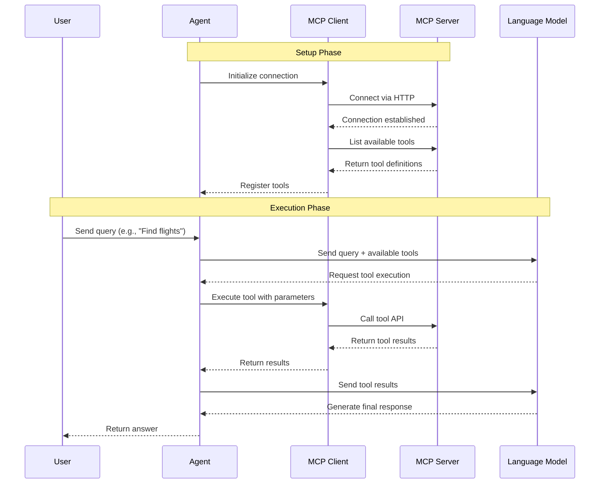

# Lab 05: MCP Client - Using MCP Tools in an Agent

In this lab, you will learn how to use tools from an MCP server. You will connect to the server, retrieve the available tools, and configure your agent to use them.

- ✅ Connect to an MCP server using HTTP transport
- ✅ Retrieve tools from an MCP server dynamically
- ✅ Configure an agent to use MCP tools
- ✅ See agents automatically call remote MCP tools based on user requests

## Key Implementation Details

### What is MCP (Model Context Protocol)?

MCP is a standard protocol that allows AI agents to discover and use tools from remote servers. Instead of embedding all tools directly in your agent code, you can:

- **Host tools on separate servers** — keep tool logic separate and reusable
- **Share tools across multiple agents** — one MCP server can serve many agents
- **Update tools without redeploying agents** — the MCP server can be updated independently
- **Use tools from different vendors** — any MCP-compliant server works

The MCP client connects to the server, discovers available tools, and makes them available to the agent as if they were local functions.

### Connecting to an MCP Server

The lab uses HTTP transport to connect to the MCP server with API key authentication. Here's how it works:

```csharp
// Get API key from environment or use default dev key
var mcpApiKey = Environment.GetEnvironmentVariable("MCP_FLIGHT_SEARCH_API_KEY");

// Create HTTP client with API key header
var httpClient = new HttpClient { BaseAddress = new Uri(mcpBaseUrl) };
httpClient.DefaultRequestHeaders.Add("X-API-KEY", mcpApiKey);

// Configure HTTP transport
var transportOptions = new HttpClientTransportOptions
{
    Endpoint = new Uri($"{mcpBaseUrl}/mcp")
};

var transport = new HttpClientTransport(transportOptions, httpClient, loggerFactory);

// Create MCP client
var client = await McpClient.CreateAsync(transport, clientOptions, loggerFactory);
```

The API key (`X-API-KEY` header) authenticates your client with the MCP server. Without a valid API key, the server will reject the connection.

### Discovering Tools from the MCP Server

Once connected, retrieve the tools that the server provides:

```csharp
var mcpTools = await mcpClient.ListToolsAsync();
```

The server returns a list of tools with their names, descriptions, and parameter schemas. The agent uses this information exactly like local tools. It reads the descriptions to decide when to call each tool.

### Adding MCP Tools to the Agent

MCP tools work seamlessly with local tools:

```csharp
var agent = chatClient.AsAIAgent(new ChatClientAgentOptions
{
    Name = "TravelAssistant",
    ChatOptions = new()
    {
        Instructions = "You are a helpful travel assistant that can search for flights...",
        Tools = [.. mcpTools]  // Spread the MCP tools into the agent's tool list
    }
});
```

The agent cannot tell the difference between local and remote tools. When it decides to call an MCP tool, the MCP client handles the HTTP request to the server, waits for the response, and returns the result.

### The MCP Flight Search Server

The Contoso Travel MCP server (`src/mcp`) exposes flight search tools:

- **SearchFlights** — search for flights between two cities
- **GetFlightByNumber** — look up flight details by flight number

The server reads from the same `data/flights_data.json` file but exposes this data as remote tools.

---

### Sequence Diagram



### Setup Phase

1. Agent initializes and connects to the MCP server using HTTP transport and API key authentication.
2. MCP client retrieves the list of available tools from the server and registers them with the agent.

### Execution Phase

1. User sends a query to the agent (e.g., "Find me flights from Melbourne to Auckland").
2. Agent sends the query along with the available tools to the language model.
3. Language model decides to call an MCP tool based on the query and tool descriptions.
4. Agent executes the tool via the MCP client, which makes an HTTP request to the MCP server.
5. MCP server processes the request, executes the tool logic, and returns the results.
6. Agent receives the tool results and sends them back to the language model.
7. Language model generates a final response using the tool results and returns it to the agent.
8. Agent returns the final answer to the user.

---

## Instructions

### Step 1: Navigate to the Lab Folder

```bash
cd labs/00-foundations/lab05-mcp
```

### Step 2: Run the Program

With .NET 10's file-based apps, you can run the single .cs file directly:

```bash
dotnet run Program.cs
```

Or in Visual Studio Code, open Program.cs and click the **"Run"** button that appears above the code.

### Step 3: Observe the Output

You should see:

1. The agent connecting to the MCP server defined in your `.env` file as `MCP_FLIGHT_SEARCH_TOOL_BASE_URL` and authenticating with the API key `MCP_FLIGHT_SEARCH_API_KEY`
2. Retrieved tool count logged (e.g., "Retrieved 4 tools from MCP server")
3. The user query: "Can you find me flights from Melbourne to Auckland?"
4. The agent automatically calling the `SearchFlights` tool from the MCP server

---

## Challenges and Next Steps

**Try different queries**

**Combine local and remote tools**
- Add a local date calculation tool (like in Lab 05) alongside the MCP tools.
- Ask: `"Find me flights from Sydney to Paris and tell me how many days until departure"`.
- Watch the agent call both a remote MCP tool and a local tool in one turn.

**Experiment with server failures**
- Stop the MCP server (Ctrl+C in its terminal) and run the lab again.
- Observe the error handling. The agent should gracefully report that it cannot connect to the MCP server.