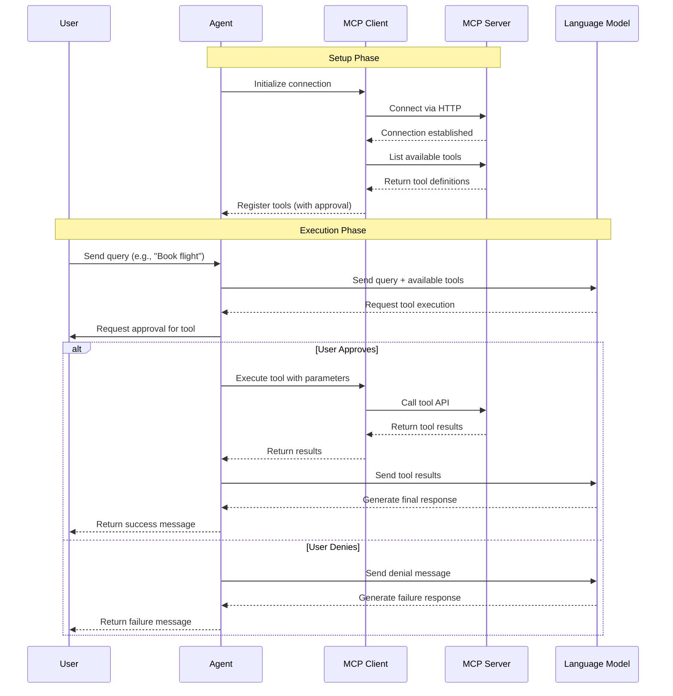

# Lab 06: Tool Call Approval

In this lab, you will implement human-in-the-loop approval for sensitive operations. The agent will request explicit user approval before executing certain tools, like booking flights. This provides a safety mechanism to prevent unwanted actions.

- ✅ Wrap sensitive tools with approval requirements
- ✅ Implement approval request handling in the agent loop
- ✅ Test approving and denying tool execution

## Key Implementation Details

### What is Human-in-the-Loop?

Human-in-the-loop (HITL) is a pattern where AI agents must get explicit approval from a human before executing certain operations. This is critical for:

- **Sensitive operations** — booking, purchasing, deleting data
- **High-impact decisions** — sending emails, making commitments
- **Safety and control** — ensuring humans remain in control of important actions

### Wrapping Tools with Approval Requirements

The `ApprovalRequiredAIFunction` class wraps an existing tool and intercepts execution to request approval:

```csharp
if (string.Equals(toolName, "book_flight", StringComparison.OrdinalIgnoreCase))
{
    // Wrap BookFlight with ApprovalRequiredAIFunction
    AIFunction bookFlightWithApproval = new ApprovalRequiredAIFunction(tool);
    tools.Add(bookFlightWithApproval);
}
else
{
    tools.Add(tool);  // Other tools execute normally
}
```

When the agent tries to call `book_flight`, instead of executing immediately, the system generates a `FunctionApprovalRequestContent` that must be handled by your code.

### Handling Approval Requests

The agent loop checks for approval requests and prompts the user at the console:

```csharp
List<FunctionApprovalRequestContent> approvalRequests = response.Messages
    .SelectMany(m => m.Contents)
    .OfType<FunctionApprovalRequestContent>()
    .ToList();

while (approvalRequests.Count > 0)
{
    // Ask the user to approve each function call request
    List<ChatMessage> userInputResponses = approvalRequests.ConvertAll(functionApprovalRequest =>
    {
        Console.WriteLine($"The agent would like to invoke the following function, please reply Y to approve: Name {functionApprovalRequest.FunctionCall.Name}");
        return new ChatMessage(ChatRole.User, 
            [functionApprovalRequest.CreateResponse(Console.ReadLine()?.Equals("Y", StringComparison.OrdinalIgnoreCase) ?? false)]);
    });

    // Pass the approval/denial back to the agent
    response = await agent.RunAsync(userInputResponses, session);
    
    // Check for more approval requests
    approvalRequests = response.Messages.SelectMany(m => m.Contents).OfType<FunctionApprovalRequestContent>().ToList();
}
```

This loop:

1. Detects when the agent wants to call an approval-required tool
2. Prompts the user at the console to approve (Y) or deny
3. Sends the approval decision back to the agent
4. Continues processing until no more approvals are needed

---

### Sequence Diagram



### Setup Phase

1. Agent initializes and connects to the MCP server using HTTP transport and API key authentication.
2. MCP client retrieves the list of available tools from the server and registers them with the agent, wrapping sensitive tools with `ApprovalRequiredAIFunction`.

### Execution Phase

1. User sends a query to the agent (e.g., "Book me a flight from Melbourne to Auckland").
2. Agent sends the query along with the available tools to the language model.
3. Language model decides to call an MCP tool based on the query and tool descriptions.
4. Instead of executing immediately, the agent detects that the tool requires approval and prompts the user for approval. The user can approve (Y) or deny (N).
5. If the user approves, the agent executes the tool via the MCP client, which makes an HTTP request to the MCP server.
6. MCP server processes the request, executes the tool logic, and returns the results.
7. Agent receives the tool results and sends them back to the language model.
8. Language model generates a final response using the tool results and returns it to the agent.

---

## Instructions

### Step 1: Navigate to the Lab Folder

```bash
cd labs/00-foundations/lab06-tool-approval
```

### Step 2: Run the Program

With .NET 10's file-based apps, you can run the single .cs file directly:

```bash
dotnet run Program.cs
```

Or in Visual Studio Code, open Program.cs and click the **"Run"** button that appears above the code.

### Step 3: Observe the Approval Flow

You should see:

1. The agent connecting to the MCP server defined in your `.env` file as `MCP_FLIGHT_SEARCH_TOOL_BASE_URL` and authenticating with the API key `MCP_FLIGHT_SEARCH_API_KEY`

2. **Approval prompt** — The console displays:

   ```
   The agent would like to invoke the following function, please reply Y to approve: Name book_flight
   ```

3. **Waiting for input** — The program waits for you to type Y or N. Type `Y` and press Enter to approve the booking.
4. The agent executes the `book_flight` tool and confirms the booking with details.

### Step 4: Try Denying Approval

Run the program again, but this time:

1. When prompted to approve the booking, type `N` (or anything other than Y)
2. Press Enter to submit your response
3. The agent responds when the booking is denied. The tool does not execute, and the agent lets the user know the booking was not completed.

---
